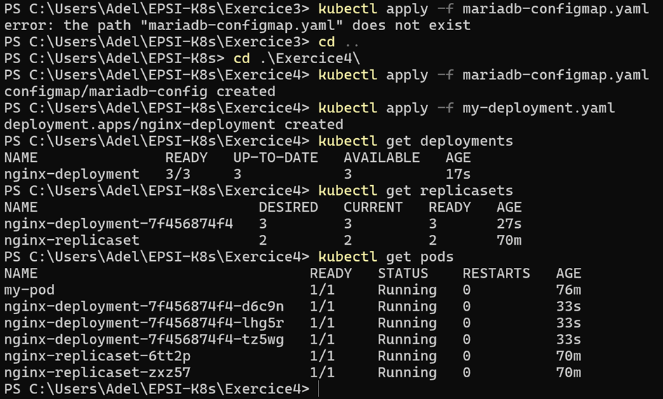

#### Exercice 4 : wordpress

1. mise en place de la configmap mariadb
2. deploiement wordpress

Je n'ai pas fait de captures au moment de l'exercice 
car je comptais revenir plus tard pour le faire proprement 
mais j'ai eu le probleme wsl du coup docker ne démarre plus

