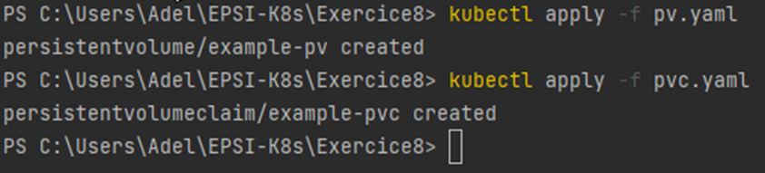
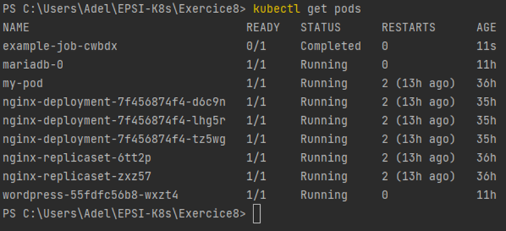
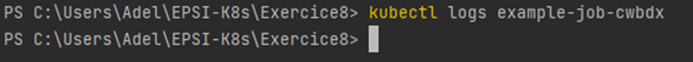

#### Exercice 8 : Jobs, CronJobs et Volumes

dans cet exercice j'ai appris le concept de jobs et de cronjobs 
ainsi que l'utilisation de volumes pour stocker les données persistantes
je n'ai malheureusement pas pu faire plus de captures d'écran
